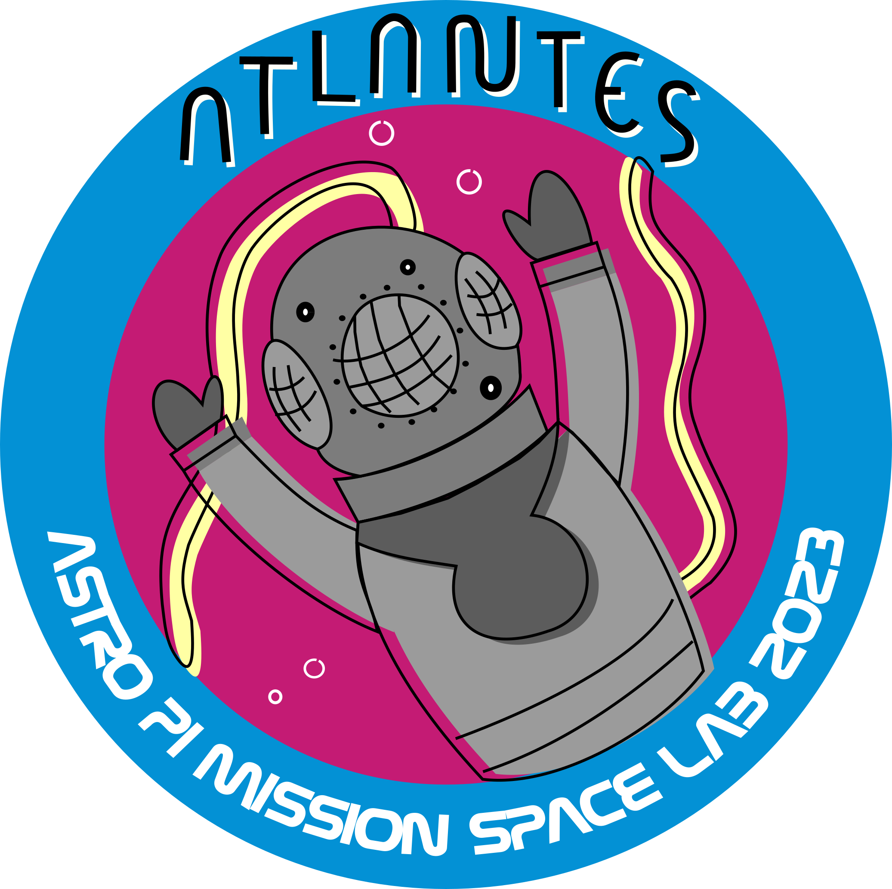

# AstroPi: Mission Space Lab. Team Atlantes 2022-2023

In this repository can be found the reports and Jupyter notebooks used during the project.

The source data produced by AstroPi IR in ISS, and several files needed by notebooks can be found here:
[https://niubit.net/media/uploads/images/atlantes_2022-2023/atlantes_files_for_colab.zip](https://niubit.net/media/uploads/images/atlantes_2022-2023/atlantes_files_for_colab.zip)

The main Jupyter notebook where the whole project is developed, in addition to this repository (`notebooks` directory), can be found in this link to be executed in Google Colab:
[https://drive.google.com/file/d/16GmYvto7nTvwt1k91wB4xtj5O_W37Co7/view?usp=sharing](https://drive.google.com/file/d/16GmYvto7nTvwt1k91wB4xtj5O_W37Co7/view?usp=sharing)